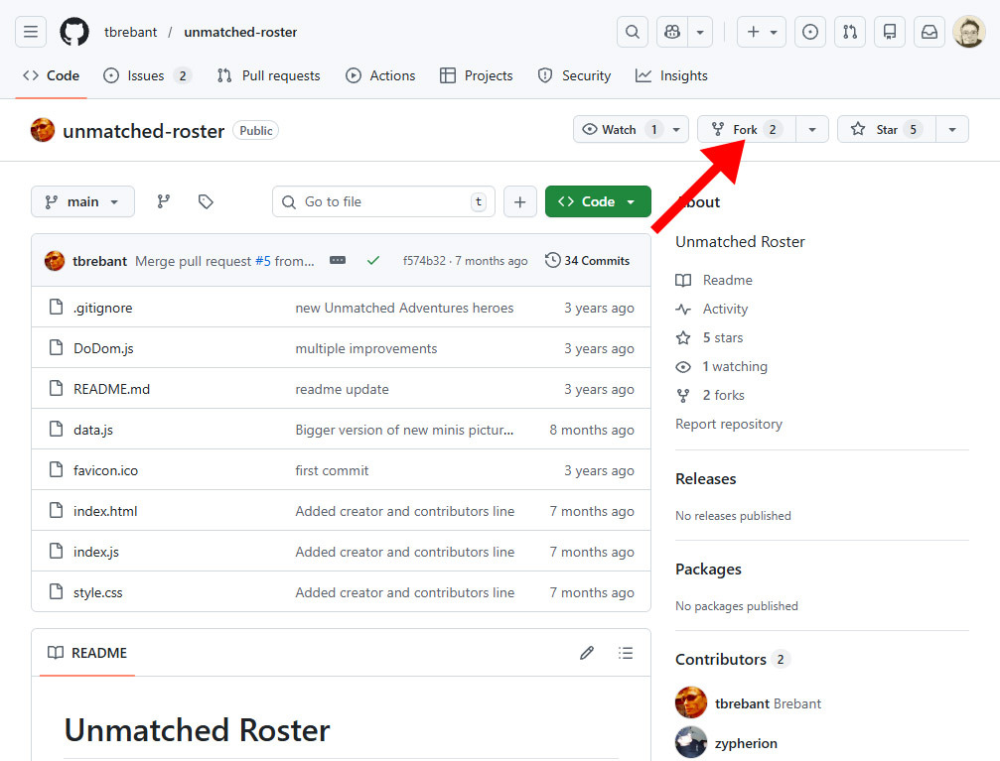
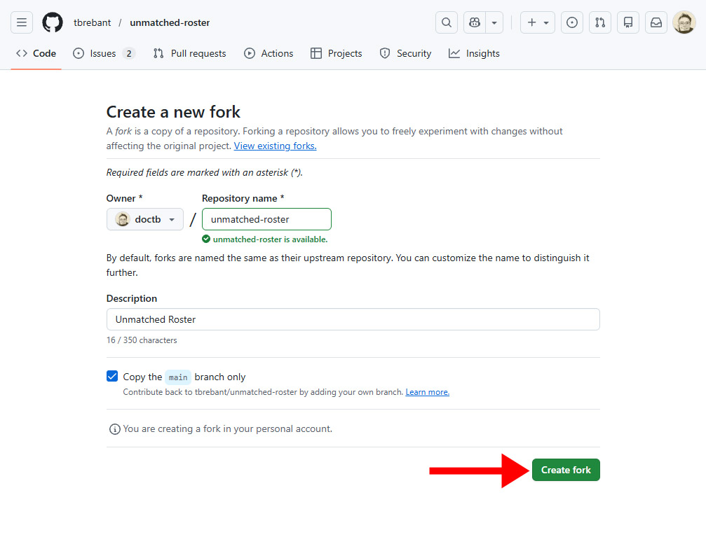
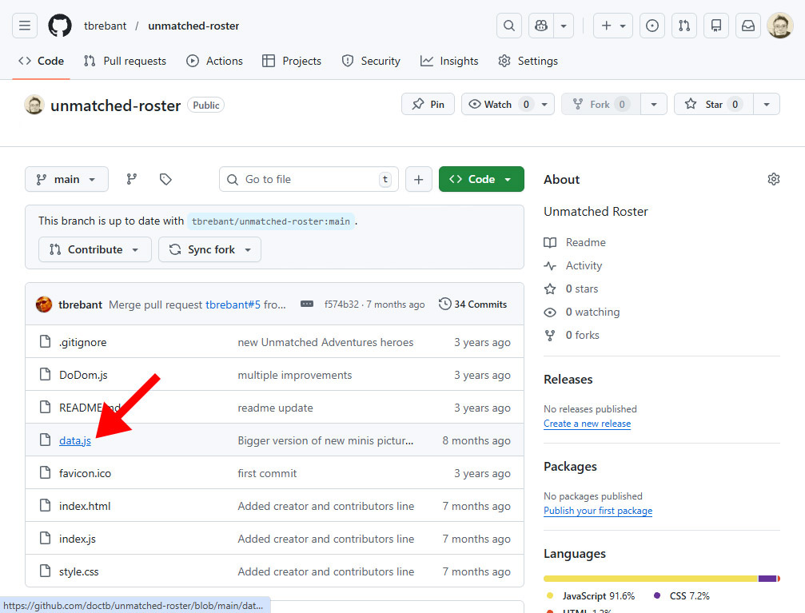
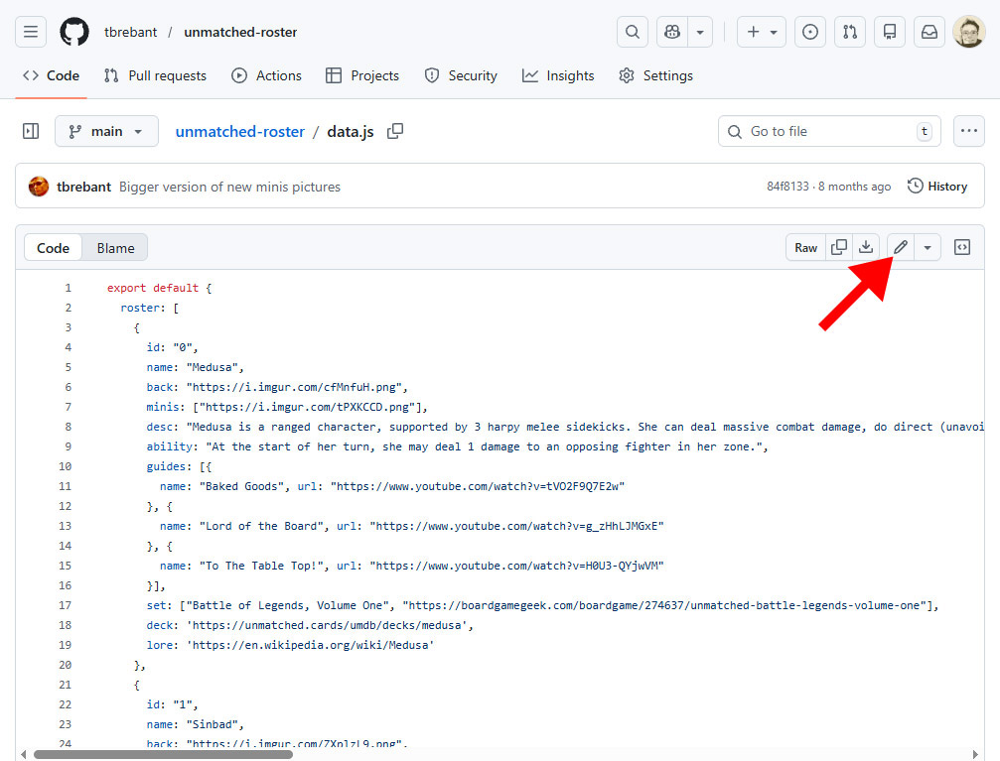
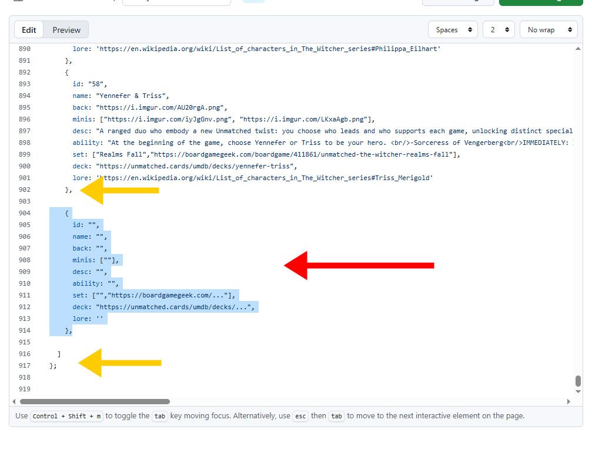
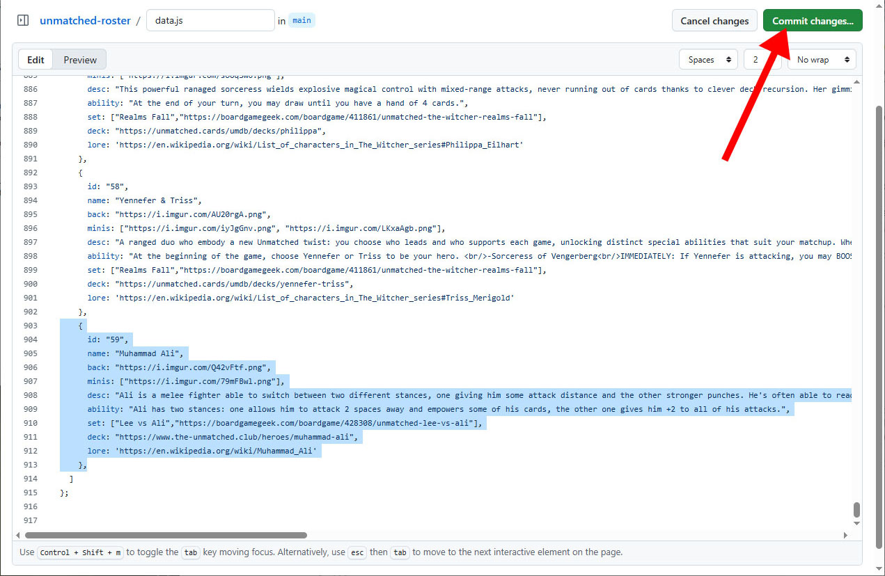
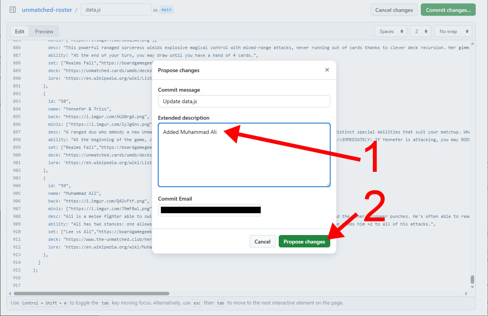
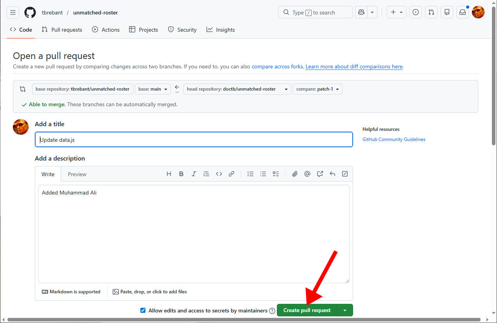
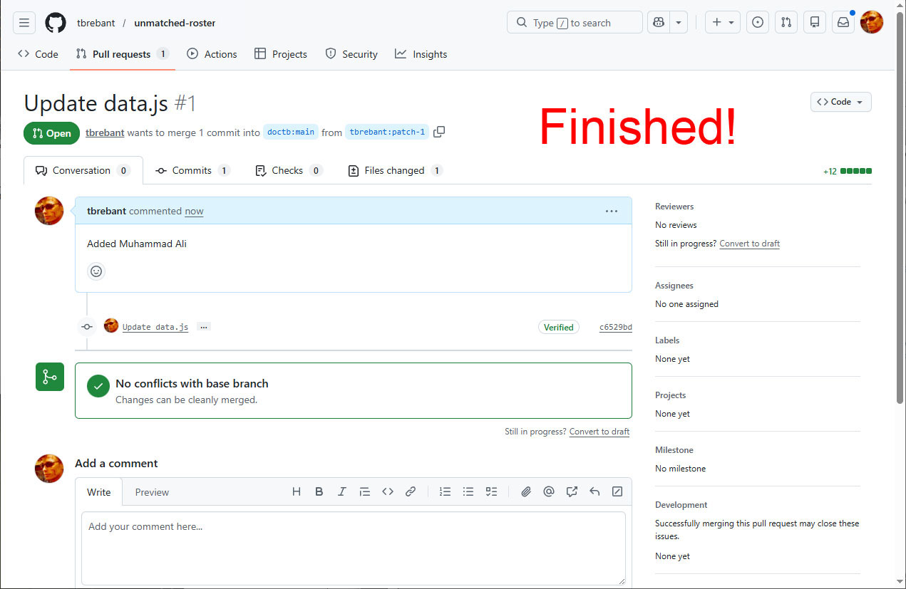

# Guide to add a new fighter to *Unmatched Roster*

This guide is written for people who don't know anything about GitHub and development. If you have any question, you can contact me via [GitHub issues](https://github.com/tbrebant/unmatched-roster/issues).

# A) Very first time preliminaries

**1)** Create a GitHub Account: open https://github.com/join  , fill in your username, email, and password. Click "Create account" and follow prompts.

**2)** Sign In to GitHub: go to https://github.com/login, enter your username/email and password and click "Sign in".

**3)** Fork the repository: you can't edit the original project directly. Forking makes your own copy where you can make changes. You will be able to submit those changes later. Go on this page in your browser: https://github.com/tbrebant/unmatched-roster.

In the top-right corner, click **Fork**:

<kbd></kbd><br/>

Confirm by clicking **Create Fork**:

<kbd></kbd><br/>

Wait a bit and you will land on your own copy of the project.


# B) Add a new fighter

### 1) Prepare new fighter information

In order to add a new fighter, you will need the following data. Let's use the Muhammad Ali as an example.

**a) His name** (*Muhammad Ali*)   
**b) A short description talking about his play style** (*Ali is a melee fighter able to switch between two different stances, one giving him some attack distance and the other stronger punches. He's often able to read opponent's mind by looking at his cards.*)  
**c) His ability's description** (*Ali has two stances: one allows him to attack 2 spaces away and empowers some of his cards, the other one gives him +2 to all of his attacks.*)  
**d) Name of the Unmatched set he is in** (*Lee vs Ali*).  
**e) boardgamegeek link of the set** (*`https://boardgamegeek.com/boardgame/428308/unmatched-lee-vs-ali`*)  
**f) His deck's url in the [Unmatched Database (UmDb)](https://unmatched.cards/umdb/decks/) or in the [Unmatched Club](https://www.the-unmatched.club/heroes)** (*`https://www.the-unmatched.club/heroes/muhammad-ali`*)  
**g) A url leading to some lore information** (*`https://en.wikipedia.org/wiki/Muhammad_Ali`*).  
**h) An image of his card background.** Upload it to a website such as imgur. (*`https://i.imgur.com/Q42vFtf.png`*)    
**i) One image for each miniature this fighter has (usually one but sometimes multiple).** Upload it/them to a website such as imgur. (*`https://i.imgur.com/79mFBwl.png`*)

### 2) Edit `data.js`

Go to the original repo: https://github.com/tbrebant/unmatched-roster.

Click `data.js`:

<kbd></kbd><br/>

Edit the file by clicking the ✏️ pencil icon:

<kbd></kbd><br/>

Go to the bottom of the file, and copy/paste the following code as shown on the next screenshot:

```js
    {
      id: "",
      name: "",
      back: "",
      minis: [""],
      desc: "",
      ability: "",
      set: ["","https://boardgamegeek.com/..."],
      deck: "https://unmatched.cards/umdb/decks/...",
      lore: ""
    },
```

<kbd></kbd><br/>

And start adding your information. Be careful to the following things:

⚠️ For the `id`, add 1 to the previous' entry id. In above's screenshot, the previous entry has an id: 58, so new one is 59.

⚠️ Never include any double quote `"` in your texts, they are used only to wrap them.

⚠️ If the fighter you are adding has multiple minis, add the urls like this in the array:
`minis: ["url1", "url2", "url3"],` etc.

And here is the completed Ali block:

```js
{
  id: "59",
  name: "Muhammad Ali",
  back: "https://i.imgur.com/Q42vFtf.png",
  minis: ["https://i.imgur.com/79mFBwl.png"],
  desc: "Ali is a melee fighter able to switch between two different stances, one giving him some attack distance and the other stronger punches. He's often able to read opponent's mind by looking at his cards.",
  ability: "Ali has two stances: one allows him to attack 2 spaces away and empowers some of his cards, the other one gives him +2 to all of his attacks.",
  set: ["Lee vs Ali","https://boardgamegeek.com/boardgame/428308/unmatched-lee-vs-ali"],
  deck: "https://www.the-unmatched.club/heroes/muhammad-ali",
  lore: "https://en.wikipedia.org/wiki/Muhammad_Ali"
},
```

Click the "Commit changes..." button:

<kbd></kbd><br/>

Describe the changes you did (1) and click "Propose changes":

<kbd></kbd><br/>

Double check that "base repository" starts with `tbrebant/`. Click on "Create pull request":

<kbd></kbd><br/>

Click on "Create pull request" (you can also add some comments in the description, for instance a name/link if you would like me to add you to the contributors list):

<kbd></kbd><br/>

And you are finally done!

<kbd></kbd><br/>


# C) What happens next?

I will have a look at your contribution, fix small things if needed and merge your changes. Once done, your addition will appear on the *Unmatched Roster* website.

I generally need between two and seven days to take care of a PR. You can get in touch with me through [GitHub issues](https://github.com/tbrebant/unmatched-roster/issues), I usually answer quickly.

Also don't forget to give me a name and a url if you want to be added to the list of the contributors at the bottom of the page.

That's all! Thank you for contributing to *Unmatched Roster*!

